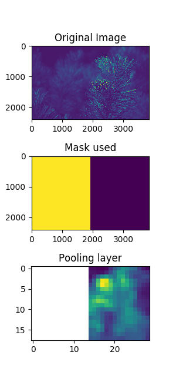

# overpool

Make a 2D pooling layer by walking in half windows over a 2D image (`whs`:= *window half-side*). Pooling is the operation of reducing image dimensions in a relevant way, usually for machine learning purposes. The pooling function is arbitrary (see in the "Examples" subsection bellow).


## Examples

### RGB image test

Function used over every color layer. Parameters used:
```python
whs = 64
pool_func = np.ptp  # (maximum value - minimum value)
```


### 2D NetCDF variable test

A 2D NetCDF variable is basically a 2D image of an only channel. It is commonly has too big dimensions, and this code was actually made for dealing with them, in the context of machine learning.

Parameters used:
```python
whs = 512
def pool_func(x):
    try:
        val = np.nanvar(x)
    except:              # if a window is full of NaNs,
        val = np.var(x)  # calculate simple variance
    return(val)
```


### One channel image masked pool test

More complex functions can be used for `pool_func` by using `give_window=True` as a keyword to `overlapping_pool`. Here the function created operates at one image considering a mask over it.

Parameters used:
```python
whs = 128
def pool_func(img, window, mask):
    masked = np.ma.masked_array(img,
                    mask=mask[window[0][0]:window[0][1],
                              window[1][0]:window[1][1]])
    try:    result = np.nanmean(masked)
    except: result = np.mean(masked)
    return(result)
```


